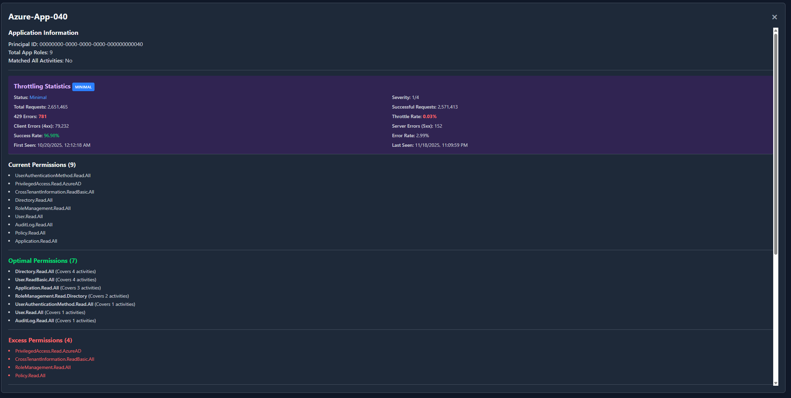
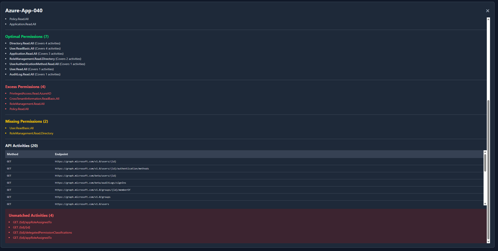

# LeastPrivilegedMSGraph

Analyzes Microsoft Graph permissions and provides least privileged recommendations

[](https://github.com/Mynster9361/Least_Privileged_MSGraph/actions/workflows/ci-cd.yml)
[](https://www.powershellgallery.com/packages/LeastPrivilegedMSGraph/)
[](https://www.powershellgallery.com/packages/LeastPrivilegedMSGraph/)

## Table of Contents

- [LeastPrivilegedMSGraph](#leastprivilegedmsgraph)
  - [Table of Contents](#table-of-contents)
  - [Description](#description)
      - [Front Page](#front-page)
      - [Details Modal - Top](#details-modal---top)
      - [Details Modal - Bottom](#details-modal---bottom)
      - [Sample report](#sample-report)
    - [So what is it?](#so-what-is-it)
    - [What it isn't](#what-it-isnt)
    - [The goal is to always follow least privelegde permisisons on our SP (Service Principals) / MI (Managed Identity) based on what these SP/MI are being used for.](#the-goal-is-to-always-follow-least-privelegde-permisisons-on-our-sp-service-principals--mi-managed-identity-based-on-what-these-spmi-are-being-used-for)
  - [Installation](#installation)
    - [From Source](#from-source)
  - [Quick Start](#quick-start)
    - [Pipe everything](#pipe-everything)
  - [Development Guide](#development-guide)
    - [Prerequisites](#prerequisites)
    - [Setting Up Development Environment](#setting-up-development-environment)
    - [Project Structure](#project-structure)
    - [Development Workflow](#development-workflow)
      - [1. Daily Development Cycle](#1-daily-development-cycle)
      - [2. Feature Development Process](#2-feature-development-process)
    - [Writing Functions](#writing-functions)
      - [Public Functions](#public-functions)
      - [Private Functions](#private-functions)
      - [Classes](#classes)
    - [Testing](#testing)
      - [Test Structure](#test-structure)
      - [Writing Unit Tests](#writing-unit-tests)
      - [Running Tests](#running-tests)
    - [Building and Packaging](#building-and-packaging)
      - [Build Commands](#build-commands)
      - [Build Configuration](#build-configuration)
      - [Continuous Integration](#continuous-integration)
      - [Release Process](#release-process)
  - [Contributing](#contributing)
    - [Quick Contribution Steps](#quick-contribution-steps)
  - [Changelog](#changelog)
  - [Additional Resources](#additional-resources)
  - [Support](#support)

## Description

LeastPrivilegedMSGraph is a PowerShell module designed to help getting a better grasph on MSGRAPH permission assignments and help limitating access permissions assigned on apps based on actual usage.

To show an example of what the report could look like here is a bit of visual aid so to speak.

#### Front Page


#### Details Modal - Top


#### Details Modal - Bottom


#### Sample report

You are more than welcome to go and download the anonymized html report that can be found here

[sample_report.html](data/report_anonymized.html)

To play arround with an already generated report with 50 diffrent app registrations.

### So what is it?

Well i have personally always felt that auditing permission assignments and so on on App/Enterprise Application to be an almost impossible task because there are so many and most are from legacy and you might not even try and attempt to touch those which i guess is understandable from some viewpoints.

This module utilizes MS Graph to first query all App registrations that has been assigned any permissions to the Enterprise Microsoft Application called Microsoft Graph.

Once it has this list it will translate the permission ID's into Friendly names because hell if i can remember what some random GUID translates to.

Then I utilize Diagnostic logs from Entra called Microsoft Graph Activity Logs to view what the specific application has been doing.
Since an app can be making tons of calls over a period and sometimes the same calls for that matter i anonymize the url's so any identifying properties in the calls is being removed (unless you specify you want to retain them but note it can cause some performance issues so you would properly need to query for less data) then i grab only the unique entries from that so we might get it down from 2M calls to only 5 URL's that we actually need to look up the permissions for. 
  - You can read about what it is and how to set it up [here](https://learn.microsoft.com/en-us/graph/microsoft-graph-activity-logs-overview)


Finnaly we can create a report just to get an insights into our permisison structure.

Now before the first release of the module i decided to include something else i at least have found usefull from time to time but that in no way has anything to do with permisisons which is throttling.
From time to time you might find that you are being throttled and it can be very hard to identify how much/how often so there is also a possibility to include some statistics on how much your apps are being throttled within the report.


### What it isn't

Well like anything that is free it is not perfect.

The basis of this module i feel is in a very good place with the current setup and sure somethings could be better and i wish to deliver on that part but to do that i would also love any and all feedback whether you lvoe it or hate it if there is anything that you feel is not the way it should be then please reach out either through a Github Issue or through my own [LinkedIn](https://www.linkedin.com/in/mortenmynster/) My messages are open 

Here are some of the things i can say right of the bat that is not perfect and that will still require you to have some knowledge about MSGraph and the permission structure itself so it is not your north star (Not yet atleast)
  - Permissions recommendation is not always spot on like an optimal permission for an application utilizing Sharepoint on specific sites should utilize Sites.Selected roles and not Sites.Read.All.
  - The way certain objects correlate like if you have Group.Read.All and want to get all members then i am guessing you would also like some User.ReadBasic.all Permissions in order to get more than just ID's of the users in groups.
  - Currently this module does not include any permission report in regards to delegated permissions it only looks for Application permissions


### The goal is to always follow least privelegde permisisons on our SP (Service Principals) / MI (Managed Identity) based on what these SP/MI are being used for.

In the future i hope that we find a way to 
1. Get Delegated permissions included in the report as that would allow us to identify both gaps but also threats to our users and who has exposed some of their data to an app in order to limit the exposure and maybe even allow us to run some analysis on whether it could be malicius or not.
   
2. Get a better way to gather the intel for our permission comparraison in order to better determine the least privledge permission.
   - An example on this topic is something like sharepoint permissions the least priveledge permission would be something like Site.Selected and then limit the apps access rights with the PnP module (Currently this module would suggest the Sites.Read.All permission as it does not have a complete grasph of permissions that can be limited further in other platforms like sharepoint or Mail.ReadWrite.All where you can limit it in exchange with a group)
  
3. Create a correlation between what an endpoint returns and the permissions needed to read the scope of the given data. 
   - [ISSUE 1: Figure out correlation between @odata.type and corresponding least privilege permission](https://github.com/Mynster9361/Least_Privileged_MSGraph/issues/1)
   - example request something from /memberOf and you can get 3 diffrent object types back like user, group, Service Principal but if you do not have User.ReadBasic.All perms then you can only see the ID of the user and nothing else. The same goes for the 2 other categories.

## Installation

### From Source

```powershell
# Clone the repository
git clone https://github.com/Mynster9361/Least_Privileged_MSGraph.git
cd LeastPrivilegedMSGraph

# Build and install locally
./build.ps1 -ResolveDependency -Tasks build
Import-Module ./output/LeastPrivilegedMSGraph -Force
```

## Quick Start

- Prerequisites
  - An App that has Application.Read.All permisisons
  - RBAC role (Log Analytics Reader) assigned to your service principal on your workspace where Microsoft Graph Activity logs is located

```powershell
# Install the module
Install-Module LeastPrivilegedMSGraph

# Import the module
Import-Module LeastPrivilegedMSGraph

# Get available commands
Get-Command -Module LeastPrivilegedMSGraph

# Get help for a specific function
Get-Help Get-AppRoleAssignments -Full

#region Sample params needed to run below

$tenantId = "your-tenant-id"
$clientId = "App reg ID"
$clientSecret = "App reg Secret" | ConvertTo-SecureString -AsPlainText -Force
$logAnalyticsWorkspaceId = "Your log analytics workspace id"
$daysToQuery = 30 # The amount of days to look back within your workspace for the apps

#endregion Sample params needed to run below

#region Initialize log analytics service and connect to msgraph,LogAnalytics with app read all permission
Initialize-LogAnalyticsApi

Connect-EntraService -ClientID $clientId -TenantID $tenantId -ClientSecret $clientSecret -Service "LogAnalytics", "GraphBeta"

#endregion Initialize log analytics service and connect to msgraph,LogAnalytics with app read all permission

#region the good stuff Getting a full report of your app role assignments
$appRoleAssignments = Get-AppRoleAssignments | select -First 5

$appRoleAssignments | Get-AppActivityData -WorkspaceId $logAnalyticsWorkspaceId -Days $daysToQuery

$appRoleAssignments | Get-AppThrottlingData -WorkspaceId $logAnalyticsWorkspaceId -Days $daysToQuery

$appRoleAssignments | Get-PermissionAnalysis

New-PermissionAnalysisReport -AppData $appRoleAssignments -OutputPath ".\report.html"

#endregion the good stuff Getting a full report of your app role assignments
```

### Pipe everything
```powershell
# You could also just pipe it all together
Get-AppRoleAssignments | 
    select -First 50 | 
    Get-AppActivityData -WorkspaceId $logAnalyticsWorkspaceId -Days $daysToQuery |
    Get-AppThrottlingData -WorkspaceId $logAnalyticsWorkspaceId -Days $daysToQuery |
    Get-PermissionAnalysis |
    New-PermissionAnalysisReport -OutputPath ".\report50.html"
```

## Development Guide

This section provides a comprehensive guide for developers who want to contribute to or extend the LeastPrivilegedMSGraph.

### Prerequisites

Before you begin developing, ensure you have the following installed:

- __PowerShell 5.1 or later__
- __Git__ for version control
- __Visual Studio Code__ (recommended) with PowerShell extension
- __.NET SDK__ (for certain build tasks)

### Setting Up Development Environment

1. __Clone the Repository__

   ```powershell
   git clone https://github.com/Mynster9361/Least_Privileged_MSGraph.git
   cd LeastPrivilegedMSGraph
   ```

2. __Bootstrap Development Dependencies__

   ```powershell
   # This will install all required modules for development
   ./build.ps1 -ResolveDependency -Tasks noop
   ```

3. __Configure VS Code__ (if using)
   - Open the project folder in VS Code
   - Install recommended extensions when prompted
   - The workspace is pre-configured with settings in [.vscode/settings.json](.vscode/settings.json)

### Project Structure

```
LeastPrivilegedMSGraph/
├── .github/                    # GitHub templates and workflows
│   ├── ISSUE_TEMPLATE/        # Issue templates
│   └── PULL_REQUEST_TEMPLATE.md
├── .vscode/                   # VS Code configuration
├── output/                    # Build output (auto-generated)
├── source/                    # Source code
│   ├── LeastPrivilegedMSGraph.psd1    # Module manifest
│   ├── LeastPrivilegedMSGraph.psm1    # Module script file
│   ├── Classes/              # PowerShell classes
│   ├── en-US/               # Help files
│   ├── Enum/                # Enumerations
│   ├── Examples/            # Usage examples
│   ├── Private/             # Private functions
│   └── Public/              # Public functions (exported)
├── tests/                     # Test files
│   ├── Unit/                # Unit tests
│   ├── Integration/         # Integration tests
│   └── QA/                  # Quality assurance tests
├── build.ps1                 # Main build script
├── build.yaml               # Build configuration
└── RequiredModules.psd1     # Development dependencies
```

### Development Workflow

#### 1. Daily Development Cycle

```powershell
# Start with a clean build
./build.ps1 -ResolveDependency -Tasks clean, build

# Run tests during development
./build.ps1 -Tasks test

# Quick test without full build
Invoke-Pester ./tests/Unit -EnableExit
```

#### 2. Feature Development Process

1. __Create a Feature Branch__

   ```powershell
   git checkout -b feature/your-feature-name
   ```

2. __Write Tests First__ (TDD Approach)

   ```powershell
   # Create test file first
   # tests/Unit/Public/New-YourFunction.tests.ps1
   ```

3. __Implement the Function__

   ```powershell
   # Create the actual function
   # source/Public/New-YourFunction.ps1
   ```

4. __Test and Validate__

   ```powershell
   ./build.ps1 -Tasks test
   ```

5. __Update Documentation__
   - Update [CHANGELOG.md](CHANGELOG.md)
   - Update function help
   - Update README if needed

### Writing Functions

#### Public Functions

Public functions go in [source/Public/](source/Public/) and are exported from the module.

__Template for Public Functions:__

```powershell
function Verb-Noun {
    <#
    .SYNOPSIS
    Brief description of what the function does.

    .DESCRIPTION
    Detailed description of the function's purpose and behavior.

    .PARAMETER ParameterName
    Description of the parameter.

    .EXAMPLE
    Verb-Noun -ParameterName "Value"
    
    Description of what this example does.

    .NOTES
    Additional notes about the function.

    .LINK
    https://github.com/Mynster9361/Least_Privileged_MSGraph
    #>
    [CmdletBinding(SupportsShouldProcess)]
    param(
        [Parameter(Mandatory, ValueFromPipeline)]
        [ValidateNotNullOrEmpty()]
        [string]$ParameterName
    )

    begin {
        Write-Verbose "Starting $($MyInvocation.MyCommand)"
    }

    process {
        if ($PSCmdlet.ShouldProcess($ParameterName, 'Process Item')) {
            try {
                # Implementation here
                Write-Verbose "Processing: $ParameterName"
                
                # Return result
                [PSCustomObject]@{
                    Name = $ParameterName
                    Processed = Get-Date
                }
            }
            catch {
                Write-Error "Failed to process '$ParameterName': $_"
                throw
            }
        }
    }

    end {
        Write-Verbose "Completed $($MyInvocation.MyCommand)"
    }
}
```

#### Private Functions

Private functions go in [source/Private/](source/Private/) and are internal helper functions to be called by anything in the [source/Public/](source/Public/). The function placed in [source/Private/](source/Private/) is not exposed to be called when the module is installed on a computer

```powershell
function ConvertTo-InternalFormat {
    <#
    .SYNOPSIS
    Internal helper function.
    #>
    [CmdletBinding()]
    param(
        [Parameter(Mandatory)]
        [object]$InputObject
    )

    # Helper logic here
    return $processedObject
}
```

#### Classes

Define classes in [source/Classes/](source/Classes/) with numbered prefixes for load order:

```powershell
# source/Classes/1.BaseClass.ps1
class BaseBusinessObject {
    [string]$Id
    [datetime]$Created
    
    BaseBusinessObject() {
        $this.Id = [System.Guid]::NewGuid().ToString()
        $this.Created = Get-Date
    }
}

# source/Classes/2.DerivedClass.ps1
class SpecificBusinessObject : BaseBusinessObject {
    [string]$Name
    [string]$Department
    
    SpecificBusinessObject([string]$Name, [string]$Department) : base() {
        $this.Name = $Name
        $this.Department = $Department
    }
}
```

### Testing

The module uses __Pester__ for testing. All functions should have corresponding tests.

#### Test Structure

```
tests/
├── Unit/
│   ├── Public/              # Tests for public functions
│   ├── Private/             # Tests for private functions
│   └── Classes/             # Tests for classes
├── Integration/             # Integration tests
└── QA/                      # Quality assurance tests
```

#### Writing Unit Tests

```powershell
# tests/Unit/Public/Get-Something.tests.ps1
BeforeAll {
    $script:moduleName = 'LeastPrivilegedMSGraph'
    
    # Remove any existing module
    Get-Module -Name $script:moduleName -All | Remove-Module -Force
    
    # Import the module being tested
    Import-Module -Name $script:moduleName -Force
}

AfterAll {
    # Clean up
    Get-Module -Name $script:moduleName -All | Remove-Module -Force
}

Describe 'Get-Something' {
    BeforeEach {
        # Setup for each test
    }

    Context 'When provided with valid input' {
        It 'Should return expected result' {
            # Arrange
            $inputValue = 'TestValue'
            
            # Act
            $result = Get-Something -Name $inputValue
            
            # Assert
            $result | Should -Not -BeNullOrEmpty
            $result.Name | Should -Be $inputValue
        }

        It 'Should support pipeline input' {
            # Test pipeline functionality
            $input = @('Value1', 'Value2')
            $results = $input | Get-Something
            
            $results.Count | Should -Be 2
        }
    }

    Context 'When provided with invalid input' {
        It 'Should throw when Name is null' {
            { Get-Something -Name $null } | Should -Throw
        }
    }

    Context 'When using WhatIf' {
        It 'Should support WhatIf parameter' {
            { Get-Something -Name 'Test' -WhatIf } | Should -Not -Throw
        }
    }
}
```

#### Running Tests

```powershell
# Run all tests
./build.ps1 -Tasks test

# Run specific test suite
Invoke-Pester ./tests/Unit/Public/Get-Something.tests.ps1

# Run tests with code coverage
./build.ps1 -Tasks test -CodeCoverageThreshold 80

# Run tests in VS Code
# Use Ctrl+Shift+P -> "PowerShell: Run Pester Tests"
```

### Building and Packaging

#### Build Commands

```powershell
# Full build with dependency resolution
./build.ps1 -ResolveDependency

# Build only (no tests)
./build.ps1 -Tasks build

# Clean build
./build.ps1 -Tasks clean, build

# Build with specific configuration
./build.ps1 -BuildInfo Release -Tasks build
```

#### Build Configuration

The build process is configured in [build.yaml](build.yaml):

```yaml
# Key configuration options
ModuleVersion: '1.0.0'
PreReleaseTag: 'preview'
BuildTasks:
  - Clean
  - Build
  - Test
  - Package
```

#### Continuous Integration

The project uses GitHub Actions for CI/CD (configured in [.github/workflows/ci-cd.yml](.github/workflows/ci-cd.yml)):

- __Triggers__: Pull requests and pushes to main branch
- __Platforms__: Windows, Linux, macOS
- __PowerShell Versions__: 5.1, 7.x
- __Test Coverage__: Minimum 80% required
- __Code Analysis__: PSScriptAnalyzer rules enforced

#### Release Process

1. __Update Version__: Increment version in [GitVersion.yml](GitVersion.yml)
2. __Update Changelog__: Add entry to [CHANGELOG.md](CHANGELOG.md)
3. __Create PR__: Submit pull request with changes
4. __Merge__: After approval and CI success
5. __Tag Release__: GitHub Actions will automatically create release and publish to PowerShell Gallery

## Contributing

We welcome contributions! Please see our [Contributing Guidelines](CONTRIBUTING.md) for details on:

- How to submit issues
- How to submit pull requests
- Coding standards and style guidelines
- Testing requirements

### Quick Contribution Steps

1. Fork the repository
2. Create a feature branch: `git checkout -b feature/amazing-feature`
3. Make your changes following our guidelines
4. Add tests for your changes
5. Ensure all tests pass: `./build.ps1 -Tasks test`
6. Update documentation as needed
7. Commit your changes: `git commit -m 'Add amazing feature'`
8. Push to your branch: `git push origin feature/amazing-feature`
9. Submit a pull request

## Changelog

See [CHANGELOG.md](CHANGELOG.md) for a detailed history of changes to this project.

---

## Additional Resources

- [PowerShell Gallery](https://www.powershellgallery.com/packages/LeastPrivilegedMSGraph)
- [Sampler Documentation](https://github.com/gaelcolas/Sampler)
- [Pester Documentation](https://pester.dev/)
- [PowerShell Best Practices](https://github.com/PoshCode/PowerShellPracticeAndStyle)

## Support

- __Issues__: Report bugs and feature requests using [GitHub Issues](.github/ISSUE_TEMPLATE/)

---

*Generated with Sampler template*
