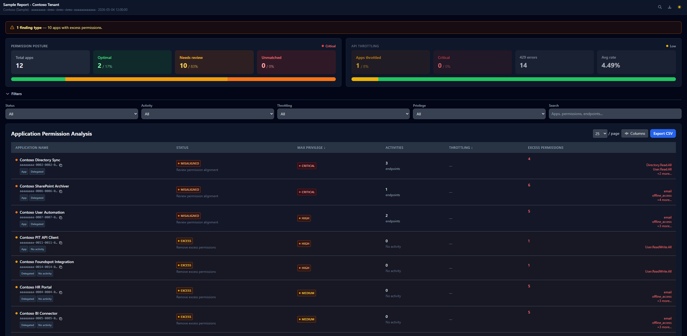
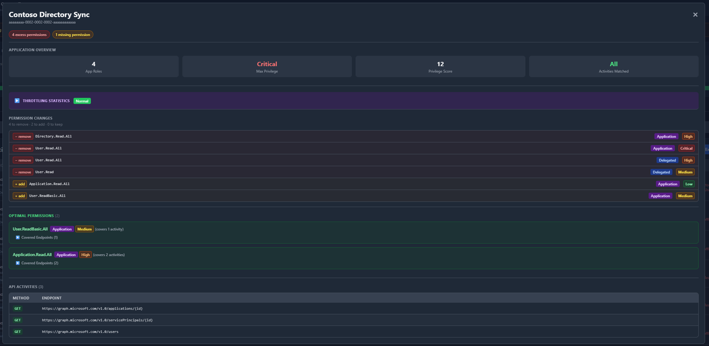

# LeastPrivilegedMSGraph

A PowerShell module that audits Microsoft Graph permission assignments and recommends least-privilege permissions based on actual app activity.

[](https://github.com/Mynster9361/Least_Privileged_MSGraph/actions/workflows/ci-cd.yml)
[](https://www.powershellgallery.com/packages/LeastPrivilegedMSGraph/)
[](https://www.powershellgallery.com/packages/LeastPrivilegedMSGraph/)

## What it does

- Queries all app registrations with Microsoft Graph permissions assigned
- Translates permission GUIDs into friendly names
- Cross-references against [Microsoft Graph Activity Logs](https://learn.microsoft.com/en-us/graph/microsoft-graph-activity-logs-overview) to see what endpoints each app actually calls
- Anonymizes API URLs to reduce noise (millions of calls → unique URL patterns)
- Generates an HTML report showing current permissions, optimal permissions, and excess permissions per app
- Optionally includes throttling statistics per app

## Report Preview

| Front Page | Details Modal |
|---|---|
|  |  |

Try the [sample report](data/sample-report.html) — an anonymized example with 50 app registrations.

## Prerequisites

- **Entra ID P1 or P2** license (required for Microsoft Graph Activity Logs)
- A **Log Analytics workspace** with the `MicrosoftGraphActivityLogs` diagnostic setting enabled
- An **App Registration** with:
  - `Application.Read.All` Microsoft Graph application permission
  - `Directory.Read.All` (only needed to include delegated permissions in the report)
  - `Log Analytics Reader` RBAC role on the Log Analytics workspace

> **New to this setup?** Follow the [step-by-step setup guide](https://mynster9361.github.io/posts/LeastPrivilegedMSGraphSetup/) for a walkthrough covering Log Analytics, Entra diagnostics, and app registration configuration.

## Installation

```powershell
Install-Module LeastPrivilegedMSGraph
```

Or from source:

```powershell
git clone https://github.com/Mynster9361/Least_Privileged_MSGraph.git
cd LeastPrivilegedMSGraph
./build.ps1 -ResolveDependency -Tasks build
Import-Module ./output/LeastPrivilegedMSGraph -Force
```

## Quick Start

```powershell
$tenantId                = "your-tenant-id"
$clientId                = "your-app-id"
$clientSecret            = "your-secret" | ConvertTo-SecureString -AsPlainText -Force
$logAnalyticsWorkspaceId = "your-workspace-id"
$daysToQuery             = 30

Import-Module LeastPrivilegedMSGraph

Initialize-LPMSLogAnalyticsApi
Connect-EntraService -ClientID $clientId -TenantID $tenantId -ClientSecret $clientSecret -Service "LogAnalytics", "GraphBeta"

Get-LPMSAppRoleAssignment |
    Get-LPMSAppActivityData -WorkspaceId $logAnalyticsWorkspaceId -Days $daysToQuery |
    Get-LPMSAppThrottlingData -WorkspaceId $logAnalyticsWorkspaceId -Days $daysToQuery |
    Get-LPMSPermissionAnalysis |
    Export-LPMSPermissionAnalysisReport -OutputPath ".\report.html"
```

Use `Select-Object -First N` to limit the scope during initial testing:

```powershell
Get-LPMSAppRoleAssignment | Select-Object -First 10 |
    Get-LPMSAppActivityData -WorkspaceId $logAnalyticsWorkspaceId -Days $daysToQuery |
    Get-LPMSAppThrottlingData -WorkspaceId $logAnalyticsWorkspaceId -Days $daysToQuery |
    Get-LPMSPermissionAnalysis |
    Export-LPMSPermissionAnalysisReport -OutputPath ".\report.html"
```

Get help for any function:

```powershell
Get-Help Get-LPMSAppRoleAssignment -Full
```

## Known Limitations

- **SharePoint scoped permissions** — the module may suggest `Sites.Read.All` where `Sites.Selected` would be more appropriate
- **Cross-permission correlations** — e.g. if you query group members and need `User.ReadBasic.All` alongside `Group.Read.All`, this may not always be detected
- Recommendations are a guide, not a guarantee — use your knowledge of each app to validate suggestions

## Resources

- [Step-by-step setup guide](https://mynster9361.github.io/posts/LeastPrivilegedMSGraphSetup/)
- [PowerShell Gallery](https://www.powershellgallery.com/packages/LeastPrivilegedMSGraph)
- [Changelog](CHANGELOG.md)
- [Sample report](data/sample-report.html)

## Contributing

See [CONTRIBUTING.md](CONTRIBUTING.md) for development setup, coding standards, testing requirements, and how to submit pull requests.

## Support

- [GitHub Issues](.github/ISSUE_TEMPLATE/) — bug reports and feature requests
- [LinkedIn](https://www.linkedin.com/in/mortenmynster/) — questions and feedback
